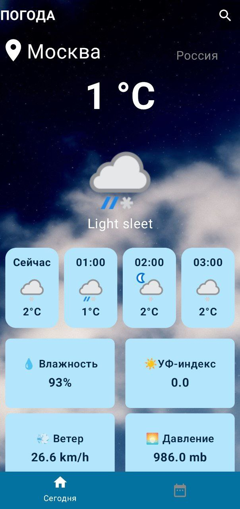
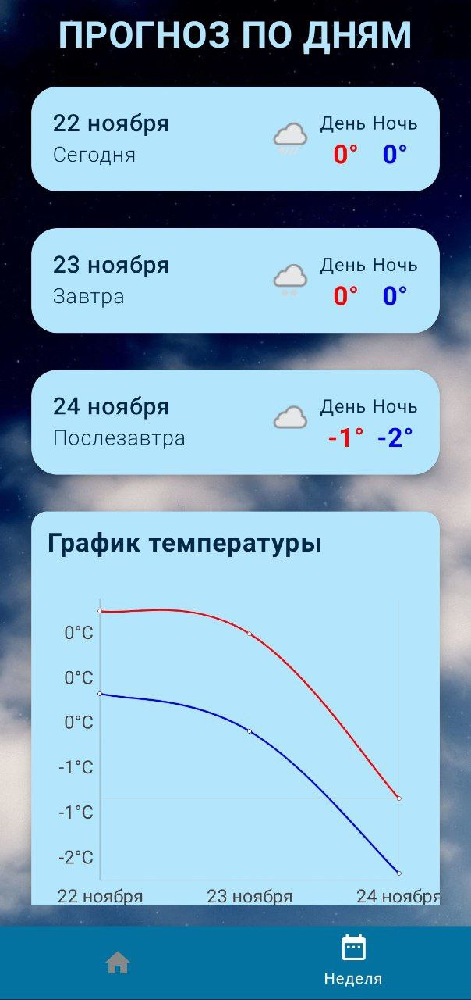
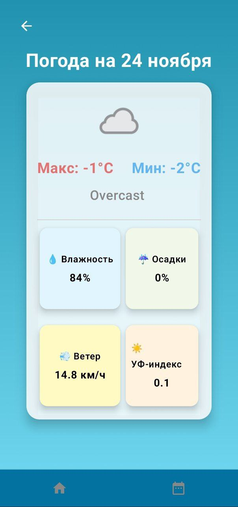

  

<h1 align="center">WeatherApp</h1>

    🌤️ Приложение для Android с прогнозом погоды, которое использует WeatherAPI . ☂️⛈️ ( Kotlin, Android Studio )

  <strong>
    <a href="#о-приложении">О приложении</a> • 
    <a href="#характеристики">Характеристики</a> • 
    <a href="#создано-с-использованием">Создано с использованием</a> • 
    <a href="#как-использовать">Как использовать</a> • 
    <a href="#поддержка-и-отзывы">Поддержка и отзывы</a>
  </strong>

    
  
    
    

## О приложении

WeatherApp — это простое приложение для прогнозирования погоды, которое использует API [WeatherApi](https://www.weatherapi.com/) для получения данных о прогнозе на 3 дня / 72 часа на основе заданного местоположения. Это приложение, разработанное в среде Android Studio, обрабатывает данные о температуре, ветре, давлении, погоде и влажности, полученные в формате JSON, и отображает их для пользователя.

____

### Характеристики
Некоторые функции, которые включает в себя проект:

- Информация о погоде по текущему местоположению
- Прогноз погоды на 3 дня
- Текущая информация о влажности, ветре и т.п.
- Поиск погоды по местоположению
- Подробная информация о погоде по часам или дням
- График температуры на ближайшие дни

____

### Создано с использованием
- [Android Studio](https://developer.android.com/studio) — Android Studio — это официальная интегрированная среда разработки (IDE) для создания приложений для Android на основе IntelliJ IDEA.
- [WeatherApi](https://www.weatherapi.com/) — WeatherApi — это онлайн-сервис, предоставляющий глобальные данные о погоде через API, включая текущие данные о погоде, прогнозы, краткосрочные прогнозы и исторические данные о погоде для любого географического местоположения.

____

### Как использовать

  

**1. При входе в приложение выполните следующие пункты для определения вашего местоположения:**
- Включите геолокацию
- Разрешите доступ к вашему местоположении

**2. Для перемещения между экранами используйте нижнюю панель навигации**

**3. Используйте горизонтальные свайпы для перемещения карточек погоды по часам**
+ Для подробной информации нажмите на карточку

**4. Для поиска по городу:**
- Нажмите на иконку поиска
- Введите название города на русском/английском

**5. Для обновления местоположения используйте свайп сверху вниз**

____

## Поддержка и отзывы
Если у вас возникли технические проблемы или вы хотите сообщить об ошибке/проблеме в приложении, напишите мне в [telegram](https://t.me/lose_benzin)
